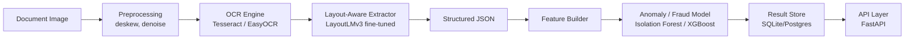

# Intelligent Document Processing & Fraud Detection Engine

A portfolio-grade, production-shaped pipeline that ingests receipt images, extracts structured data via computer vision and NLP, and flags statistically anomalous or fraudulent records via a tabular ML model — served behind a documented API and buildable at **$0** end to end.

> **Status:** Phases 0-5 are complete and validated. Phase 3 (Trained Extraction Model) fine-tuned LayoutLMv3 on real SROIE data and evaluated it against the Phase 2 baseline (F1 0.832 vs. baseline 0.889 — does not beat it, which the exit criteria treats as a valid, documentable result; see [`CHANGELOG_PHASE3.md`](./docs/CHANGELOG/CHANGELOG_PHASE3.md)). The fine-tuned model is not yet wired into the served API — Phase 5's service wrapper still runs on the Phase 2 baseline extractor as a documented deviation. See [Roadmap](#roadmap) below.

---

## What this is

Organizations spend significant manual effort converting paper/image receipts into structured data and then auditing that data for errors or fraud. IDPAFDE builds a minimal but real version of that pipeline on one document type (receipts), demonstrating applied AI/ML engineering — pipeline design, model evaluation, and deployment — rather than novel research.

For the full concept, rationale, and design rationale, see [`Concept-Paper.md`](./docs/Concept-Paper.md). For phase-by-phase planning docs, see [`docs/`](./docs).

## Planned end-to-end architecture



**Implemented today:** `A → B → C → D (baseline)`, exposed via `POST /v1/ocr/extract` and `POST /v1/extraction/baseline`. `D`'s trained-model upgrade (LayoutLMv3, Phase 3) has been fine-tuned and evaluated (see [Roadmap](#roadmap)) but is not yet swapped into the served endpoint; `E` through `I` are planned for later phases.

## Tech stack

| Layer | Choice | Notes |
|---|---|---|
| API framework | FastAPI + Uvicorn | Auto-generated OpenAPI docs at `/docs` |
| Image preprocessing | OpenCV (headless) | Deskew, denoise, CLAHE contrast normalization |
| OCR | Tesseract (via `pytesseract`) | Chosen for Phase 1 for its light footprint; EasyOCR/TrOCR are planned upgrades |
| Entity extraction | Rule-based baseline (regex + line-position heuristics) — served today; fine-tuned LayoutLMv3 — trained and evaluated, not yet served | Phase 2 (done, serving) / Phase 3 (done, not wired into API) |
| Anomaly detection *(planned)* | Isolation Forest → XGBoost | Phase 4 |
| Storage | SQLite (local) | Postgres (Supabase/Neon free tier) optional for later multi-client use |
| Containerization | Docker + docker-compose | Single-command local run |

Every tool in this stack has a genuinely free tier or is fully open-source — see `docs/05-DEPLOYMENT-FREE-TIER.md`.

## Project structure

```
IDPAFDE/
├── app/
│   ├── main.py            # FastAPI app, routes
│   ├── preprocessing.py   # deskew, denoise, contrast normalization
│   ├── ocr.py              # Tesseract OCR wrapper
│   └── extraction.py      # Rule-based baseline field extractor (Phase 2)
├── scripts/
│   ├── generate_sample_receipts.py  # synthetic receipts + ground_truth.json (stand-in for SROIE)
│   ├── prepare_layoutlm_labels.py   # BIO-labels the 3 synthetic samples (Phase 3 smoke test only)
│   └── train_layoutlmv3.py          # fine-tunes LayoutLMv3-base; run on Colab (T4), not locally
├── tests/
│   ├── test_phase0.py     # Phase 0 exit-criteria test
│   ├── test_phase1.py     # Phase 1 exit-criteria test
│   ├── test_phase2.py     # Phase 2 exit-criteria test (records to experiments.csv)
│   └── test_phase3.py     # Phase 3 exit-criteria test — evaluates models/layoutlmv3/v1/ against data/layoutlm/val.jsonl
├── data/
│   └── layoutlm/          # train.jsonl / val.jsonl / test.jsonl — SROIE BIO-labeled splits (Phase 3, gitignored)
├── models/
│   └── layoutlmv3/v1/     # fine-tuned checkpoint (Phase 3, gitignored)
├── docs/
│   ├── 00-PROJECT-CHARTER.md
│   ├── 01-ARCHITECTURE.md
│   ├── 02-DATA-STRATEGY.md
│   ├── 03-MODEL-DEVELOPMENT.md
│   ├── 04-API-SPEC.md
│   ├── 05-DEPLOYMENT-FREE-TIER.md
│   ├── 06-ROADMAP-MILESTONES.md
│   ├── 07-TESTING-EVALUATION.md
│   ├── CODEBASE-DOCUMENTATION.md
│   └── CHANGELOG/
│       ├── CHANGELOG_PHASE1.md
│       ├── CHANGELOG_PHASE2.md
│       ├── CHANGELOG_PHASE3.md
│       ├── CHANGELOG_PHASE4.md
│       └── CHANGELOG_PHASE5.md
├── requirements-phase3.txt  # train-time-only deps (torch, transformers, seqeval...), Phase 3
├── experiments.csv        # model/metric log (Phase 2+)
├── Dockerfile
├── docker-compose.yml
├── requirements.txt
└── .env.example
```

## Getting started

### Prerequisites
- Docker and Docker Compose (recommended — zero manual setup), **or**
- Python 3.12+ and a local Tesseract OCR install, for running outside a container.

### Run with Docker (recommended)

```bash
git clone <this-repo>
cd IDPAFDE
cp .env.example .env
docker compose up
```

The API will be available at `http://localhost:8000`, with interactive docs at `http://localhost:8000/docs`.

### Run locally without Docker

```bash
python -m venv venv
source venv/bin/activate        # Windows: venv\Scripts\activate
pip install -r requirements.txt
# Tesseract must also be installed on your system, e.g.:
#   Linux: sudo apt install tesseract-ocr
#   macOS:         brew install tesseract
uvicorn app.main:app --reload
```

### Environment variables

Copy `.env.example` to `.env` before running. Current variables (not all are wired into code yet — see [Known Gaps](#known-gaps)):

```
DATABASE_URL=sqlite:///./data.db
MODEL_DIR=./models
OCR_ENGINE=easyocr
LOG_LEVEL=info
```

## API (current)

### `GET /health`
Liveness/readiness check.
```json
{"status": "ok", "models_loaded": true}
```

### `POST /v1/ocr/extract`
Preprocesses and OCRs a document image, returning raw text tokens with bounding boxes and confidence. This is the Phase 1 endpoint — the full structured-extraction + fraud-scoring contract (`POST /v1/documents`, see `docs/04-API-SPEC.md`) lands in later phases.

```bash
curl -X POST http://localhost:8000/v1/ocr/extract \
  -F "file=@data/sample_receipts/sample_receipt_01.png"
```

Accepts `image/jpeg` or `image/png`; returns `422` for unsupported content types or undecodable images.

### `POST /v1/extraction/baseline`
Runs OCR then the Phase 2 rule-based extractor, returning structured fields (`merchant_name`, `date`, `total_amount`, `currency`, `extraction_confidence`, `ocr_confidence_avg`). Not yet the full `POST /v1/documents` contract — no anomaly score, no persistence (Phase 4/5).

```bash
curl -X POST http://localhost:8000/v1/extraction/baseline \
  -F "file=@data/sample_receipts/sample_receipt_01.png"
```

```json
{
  "merchant_name": "GROCERY MART",
  "date": "2026-09-01",
  "total_amount": 299.5,
  "currency": null,
  "extraction_confidence": 1.0,
  "ocr_confidence_avg": 94.33
}
```

## Generating sample data

Since the real SROIE dataset requires an authenticated manual download, a synthetic sample-receipt generator stands in for it during development:

```bash
python scripts/generate_sample_receipts.py
```

This writes three sample receipt images (one straight, two skewed) plus `ground_truth.json` (merchant_name/date/total_amount per sample, used by `test_phase2.py`) to `data/sample_receipts/`.

## Testing

```bash
python tests/test_phase0.py   # Phase 0 exit-criteria check
python tests/test_phase1.py   # Phase 1 exit-criteria check (generates samples first if missing)
python tests/test_phase2.py   # Phase 2 exit-criteria check (measures + records baseline accuracy to experiments.csv)
```

All three are automated validations tied directly to the exit criteria defined in `docs/06-ROADMAP-MILESTONES.md`.

## Roadmap

| Phase | Focus | Status |
|---|---|---|
| 0 | Setup — API skeleton, Docker, `/health` | ✅ Complete |
| 1 | Vision extraction — preprocessing + OCR | ✅ Complete |
| 2 | Baseline structured extraction (rule-based) | ✅ Complete |
| 3 | Trained extraction model (LayoutLMv3) | ✅ Complete — F1 0.832 vs. Phase 2 baseline 0.889 (does not beat it; documented, valid per exit criteria) — see [`CHANGELOG_PHASE3.md`](./docs/CHANGELOG/CHANGELOG_PHASE3.md) |
| 4 | Anomaly / fraud detection layer | ✅ Complete |
| 5 | Full service wrapper (`POST /v1/documents`) | ✅ Complete (built on Phase 2 extractor — see [`CHANGELOG_PHASE5.md`](./docs/CHANGELOG/CHANGELOG_PHASE5.md)) |
| 6 | Deployment (free-tier hosting) | ⏳ Planned — Dockerfile needs revisiting for Phase 4/5 deps first |
| 7 | *(Stretch)* Active learning / retraining loop | ⏳ Optional |

Full detail and exit criteria: [`docs/06-ROADMAP-MILESTONES.md`](./docs/06-ROADMAP-MILESTONES.md).

## Known gaps

Documented rather than hidden, per project convention (see `docs/07-TESTING-EVALUATION.md §4`):

- No authentication on the API — not production-secure as-is.
- `OCR_ENGINE` env var is not yet wired to a real engine switch; Tesseract is currently hardcoded.
- Phase 1 and Phase 2 exit criteria have been validated against synthetic sample receipts, not the real SROIE dataset (manual authenticated download not available in the environment those phases were built in). Baseline field-level accuracy (100% on synthetic data — see `experiments.csv`) should not be read as a realistic estimate for real, noisy receipt photos. Phase 3, by contrast, was trained and evaluated on real SROIE data — see `CHANGELOG_PHASE3.md`.
- Phase 3's fine-tuned model is trained and evaluated but not yet wired into the served API — `/v1/extraction/baseline` still runs the Phase 2 rule-based extractor. Serving the trained model is a Phase 5+ integration task, not yet done.
- Phase 3's validation set (93 samples) is slightly below the 100-300 document minimum `docs/02-DATA-STRATEGY.md` §3 calls usable; treat the 0.832 F1 as a solid but not maximally precise generalization estimate — see `CHANGELOG_PHASE3.md` for the trade-off considered.
- The baseline extractor's `currency` field is always `null` — no currency-symbol/code detection is implemented.
- `merchant_name` extraction uses topmost-line position only (Tesseract exposes no font-size signal), not true visual "largest text block" as the plan describes.
- No file-size limit on uploads yet.
- No persistence layer yet — each request is processed statelessly (planned for Phase 5).

Full details: [`docs/CHANGELOG/CHANGELOG_PHASE1.md`](./docs/CHANGELOG/CHANGELOG_PHASE1.md), [`docs/CHANGELOG/CHANGELOG_PHASE2.md`](./docs/CHANGELOG/CHANGELOG_PHASE2.md), and [`docs/CODEBASE-DOCUMENTATION.md`](./docs/CODEBASE-DOCUMENTATION.md).

## Cost constraint

This project is designed to be buildable and runnable at **$0** — no paid OCR/vision APIs, no paid compute, no paid datasets, anywhere in the pipeline. See [`docs/05-DEPLOYMENT-FREE-TIER.md`](./docs/05-DEPLOYMENT-FREE-TIER.md) for the specific free-tier stack and its limits.

## Documentation index

| Document | Covers |
|---|---|
| [`IDPAFDE-Concept-Paper.md`](./IDPAFDE-Concept-Paper.md) | Full concept paper: rationale, objectives, architecture, evaluation plan |
| [`docs/00-PROJECT-CHARTER.md`](./docs/00-PROJECT-CHARTER.md) | Purpose, goals, non-goals, success criteria |
| [`docs/01-ARCHITECTURE.md`](./docs/01-ARCHITECTURE.md) | System design, components, data flow |
| [`docs/02-DATA-STRATEGY.md`](./docs/02-DATA-STRATEGY.md) | Datasets, schema, labeling, synthetic fraud injection |
| [`docs/03-MODEL-DEVELOPMENT.md`](./docs/03-MODEL-DEVELOPMENT.md) | OCR, entity extraction, anomaly model plans |
| [`docs/04-API-SPEC.md`](./docs/04-API-SPEC.md) | Full planned service contract |
| [`docs/05-DEPLOYMENT-FREE-TIER.md`](./docs/05-DEPLOYMENT-FREE-TIER.md) | Free hosting & infra choices |
| [`docs/06-ROADMAP-MILESTONES.md`](./docs/06-ROADMAP-MILESTONES.md) | Phased plan with exit criteria |
| [`docs/07-TESTING-EVALUATION.md`](./docs/07-TESTING-EVALUATION.md) | Metrics, test plan, QA checklist |
| [`docs/CODEBASE-DOCUMENTATION.md`](./docs/CODEBASE-DOCUMENTATION.md) | Enterprise-style documentation of the system as currently implemented |
| [`docs/CHANGELOG/CHANGELOG_PHASE1.md`](./docs/CHANGELOG/CHANGELOG_PHASE1.md) | Detailed Phase 1 implementation record and deviations from plan |
| [`docs/CHANGELOG/CHANGELOG_PHASE2.md`](./docs/CHANGELOG/CHANGELOG_PHASE2.md) | Detailed Phase 2 implementation record and deviations from plan |

## License

This project is licensed under the [MIT License](LICENSE).
