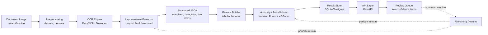

# System Architecture

## 1. High-Level Component Diagram



## 2. Component Responsibilities

### 2.1 Preprocessing
- Deskew, denoise, contrast-normalize input images.
- Library: OpenCV (free, open-source).
- Output: cleaned image, same or corrected orientation.

### 2.2 OCR Engine
- Converts pixels to raw text + bounding boxes.
- v1: EasyOCR or Tesseract (fast to integrate, no fine-tuning needed).
- v2 stretch: TrOCR for higher accuracy on noisy images.

### 2.3 Layout-Aware Extractor
- Maps raw OCR tokens + coordinates to structured entities
  (`merchant_name`, `date`, `total_amount`, `line_items`).
- v1 baseline: regex/rule-based heuristics on OCR output (fast, no
  training data required).
- v1 target: fine-tuned LayoutLMv3 (HuggingFace, open weights) once a
  labeled dataset exists.

### 2.4 Feature Builder
- Converts structured JSON + historical context into a tabular feature
  vector: amount z-score vs. merchant history, day-of-week pattern,
  round-number flag, duplicate-hash flag, OCR-confidence aggregate, etc.

### 2.5 Anomaly / Fraud Model
- Unsupervised: Isolation Forest for outlier scoring with no labels
  required.
- Supervised (once synthetic-fraud-labeled data exists): XGBoost
  classifier, compared against the Isolation Forest baseline.

### 2.6 API Layer
- FastAPI service exposing ingestion, query, and review endpoints
  (see `04-API-SPEC.md`).

### 2.7 Result Store
- SQLite for local development (zero setup, file-based, free).
- Optional: Postgres via a free-tier host (Supabase/Neon) if multi-client
  access is needed later.

### 2.8 Review Queue / Active Learning (stretch)
- Items below a confidence threshold are queued for manual correction.
- Corrections are appended to the training set for periodic retraining.

## 3. Data Flow (Sequence)

```mermaid
sequenceDiagram
    participant U as User/Client
    participant API as FastAPI
    participant OCR as OCR Engine
    participant EXT as Extractor
    participant ANOM as Anomaly Model
    participant DB as Result Store

    U->>API: POST /documents (image)
    API->>OCR: run_ocr(image)
    OCR-->>API: raw text + bboxes
    API->>EXT: extract_entities(tokens, bboxes)
    EXT-->>API: structured JSON
    API->>ANOM: score(structured JSON, history)
    ANOM-->>API: anomaly_score, flags
    API->>DB: persist(record)
    API-->>U: {fields, anomaly_score, review_required}
