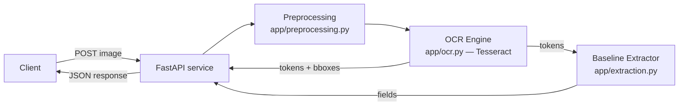
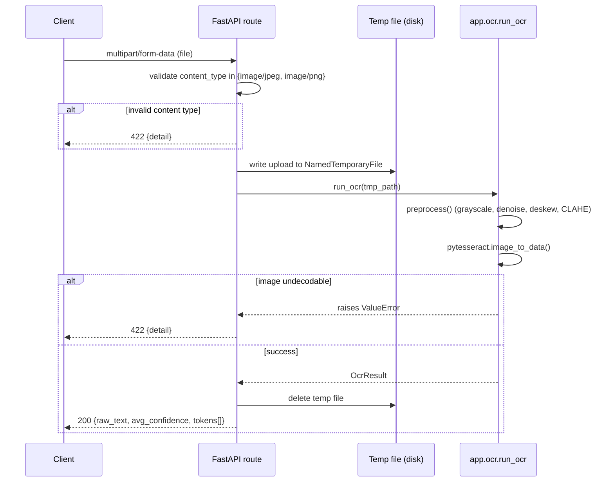

# IDPAFDE — Codebase Documentation

**Scope of this document:** This documents the codebase *as implemented
today* (Phase 0 + Phase 1 + Phase 2 complete, per `docs/06-ROADMAP-MILESTONES.md`).
Where the project's planning docs (`docs/00-*` through `docs/07-*`)
describe a future capability that does not yet exist in code, this is
explicitly marked **[PLANNED — Phase N]** rather than described as if it
were built. Treat any section without that marker as accurate to the
current `main` branch.

---

## 1. Executive Summary & High-Level Architecture

### 1.1 Core Purpose

IDPAFDE is a document-processing service that will, at full scope,
ingest receipt images, extract structured fields via OCR + NLP, and
score records for anomalies/fraud. **As currently implemented**, the
system provides the first two stages of that pipeline: image
preprocessing + OCR, and a rule-based baseline structured extractor
layered on top, exposed via two HTTP endpoints.

### 1.2 System Context



There is currently no persistence layer, no trained extraction model,
and no anomaly scoring — those are **[PLANNED — Phase 3/4/5]** per the
roadmap. The system today is stateless: each request is processed
independently and nothing is written to disk beyond a transient temp
file for the duration of one request.

### 1.3 Design Patterns Used

| Pattern | Where | Rationale |
|---|---|---|
| **Layered pipeline** | `preprocessing.py` → `ocr.py` → `extraction.py` → API route | Each stage has a single, testable responsibility; matches `docs/01-ARCHITECTURE.md` §2 |
| **Adapter / stable interface** | `run_ocr(image_path) -> OcrResult`, `extract_fields(ocr_result) -> ExtractedFields` | Isolates both the OCR engine choice (Tesseract today) and the extraction strategy (rule-based today) so Phase 3's LayoutLMv3 swap doesn't change API or caller code — `extract_fields` already takes the stable `OcrResult`/`OcrToken` shape, not engine-specific output |
| **Dataclass value objects** | `OcrToken`, `OcrResult`, `ExtractedFields` | Explicit, typed shape for pipeline output instead of passing raw dicts between layers |
| **Fail-fast validation** | Content-type check, `ValueError` on undecodable images | Reject bad input at the API boundary rather than deep in the pipeline |

### 1.4 Technology Stack (as implemented)

| Layer | Technology | Version constraint |
|---|---|---|
| Web framework | FastAPI | `>=0.112.0` |
| ASGI server | Uvicorn | `>=0.30.0` |
| Validation | Pydantic (via FastAPI) | `>=2.8.0` |
| Image processing | OpenCV (headless) | `>=4.10.0` |
| OCR engine | Tesseract via pytesseract | `>=0.3.13` (binary: system `tesseract-ocr`) |
| Entity extraction | Rule-based (stdlib `re`/`datetime`) | No external dependency — see `app/extraction.py` |
| Runtime | Python | 3.12 (Docker image); developed/tested against 3.14 locally |
| Containerization | Docker + docker-compose | — |

---

## 2. Component Breakdown & Data Flow

### 2.1 `app/main.py` — API Layer

Responsibilities: HTTP routing, request validation (content-type,
file presence), temp-file lifecycle management, error translation
(internal exceptions → HTTP status codes).

Does **not** contain business logic — OCR and preprocessing logic live
in their own modules so they remain independently testable and
importable outside the API context (e.g., from `test_phase1.py` or a
future batch-ingestion script).

### 2.2 `app/preprocessing.py` — Vision Preprocessing

| Function | Responsibility |
|---|---|
| `load_image(path)` | Decode file from disk to a BGR numpy array; raises on missing/undecodable files |
| `to_grayscale(image)` | Single-channel conversion |
| `denoise(gray)` | `cv2.fastNlMeansDenoising` — reduces scan/photo noise |
| `deskew(gray)` | Estimates rotation via `minAreaRect` over thresholded foreground pixels; corrects rotations >0.5°; returns input unchanged if too little foreground is detected (defensive, not an error) |
| `normalize_contrast(gray)` | CLAHE adaptive histogram equalization for uneven lighting |
| `preprocess(image_path)` | Composes all of the above into the single entrypoint OCR calls |

### 2.3 `app/ocr.py` — OCR Engine Wrapper

| Symbol | Responsibility |
|---|---|
| `OcrToken` | One recognized word: text, confidence (0–100), bounding box (left/top/width/height) |
| `OcrResult` | Full-document result: token list, concatenated raw text, average confidence |
| `run_ocr(image_path)` | Preprocesses the image, runs `pytesseract.image_to_data`, filters empty/non-text regions, returns `OcrResult` |
| `to_dict(result)` | JSON-serializable projection of `OcrResult`, used directly as the API response body |

### 2.4 Request Lifecycle — `POST /v1/ocr/extract`



### 2.6 `app/extraction.py` — Baseline Structured Extractor (Phase 2)

| Function | Responsibility |
|---|---|
| `_group_lines(tokens)` | Groups flat `OcrToken` list into visual lines by `top`-coordinate proximity, sorted left-to-right within each line |
| `_extract_merchant_name(lines)` | Returns the topmost non-empty line's joined text |
| `_extract_date(lines)` | Returns the first token matching one of several date regex patterns, normalized to `YYYY-MM-DD` |
| `_extract_total_amount(lines)` | Returns the largest currency-formatted number on a line containing a total/amount-due keyword, falling back to the largest currency-formatted number anywhere on the document |
| `ExtractedFields` | Dataclass: `merchant_name`, `date`, `total_amount`, `currency` (always `None` — see Known Gaps), `extraction_confidence` (fraction of the 3 fields successfully extracted) |
| `extract_fields(ocr_result)` | Composes the above into the single entrypoint, taking an `OcrResult` and returning `ExtractedFields` |
| `to_dict(fields)` | JSON-serializable projection of `ExtractedFields`, used directly as the `/v1/extraction/baseline` response body |

This is the "baseline (build first)" layer from
`docs/03-MODEL-DEVELOPMENT.md` §2.1 — pure heuristics, no training
data or model weights. See `docs/CHANGELOG/CHANGELOG_PHASE2.md` for
the heuristics' documented deviations from the plan's exact wording
(e.g. "largest" text block → topmost line, since Tesseract exposes no
font-size signal).

### 2.7 Data Flow — Not Yet Implemented

The following stages from `docs/01-ARCHITECTURE.md` §1 do not exist in
code yet and have no module, route, or storage backing them:

- Trained, layout-aware entity extraction (LayoutLMv3 fine-tune) — **[PLANNED — Phase 3]**
- Feature builder / anomaly scoring — **[PLANNED — Phase 4]**
- Result persistence (SQLite) — **[PLANNED — Phase 5]**
- Review queue / active learning — **[PLANNED — Phase 7, stretch]**

---

## 3. API Specifications & Endpoints

Base path: none for `/health` (routes are unprefixed except the Phase
1/2 endpoints, which are versioned). Full `/v1/` prefixing for all
routes is tracked as a Phase 5 cleanup per `docs/04-API-SPEC.md` §4.

### 3.1 `GET /health`

Liveness/readiness probe. Excluded from the OpenAPI schema
(`include_in_schema=False`).

**Response 200:**
```json
{"status": "ok", "models_loaded": true}
```

Note: `models_loaded: true` is currently a static literal — there is
no model-loading step yet to report on truthfully. This should be
revisited once Phase 3 introduces an actual model load at startup, so
the field reflects real state rather than a placeholder.

### 3.2 `POST /v1/ocr/extract`

Accepts one document image, returns raw OCR output. This is a Phase-1
scoped endpoint — it is **not** the `POST /documents` contract described
in `docs/04-API-SPEC.md` §1, which returns structured fields and an
anomaly score. That endpoint requires the Phase 3 extractor and Phase 4
anomaly model and does not exist yet.

**Request:** `multipart/form-data`, field `file`
**Accepted content types:** `image/jpeg`, `image/png`

**Response 200:**
```json
{
  "raw_text": "GROCERY MART 123 Main St ...",
  "avg_confidence": 94.33,
  "tokens": [
    {
      "text": "GROCERY",
      "confidence": 96.5,
      "bbox": {"left": 20, "top": 20, "width": 78, "height": 16}
    }
  ]
}
```

**Response 422 — Validation error**

Two distinct causes both return 422 with a `detail` string:

| Cause | `detail` content |
|---|---|
| Unsupported `content_type` on upload | `"Unsupported content type '<type>'. Expected one of [...]."` |
| Image bytes undecodable by OpenCV | The `ValueError` message from `app.preprocessing.load_image` |

There is currently no machine-readable error `code` field (only
`detail`) — this diverges from the `{"error": "...", "message": "..."}`
shape specified in `docs/04-API-SPEC.md` §2, which should be reconciled
in a later phase when more endpoints exist and consistent error
contracts matter more.

### 3.3 Validation Rules (current)

- `file` is required (FastAPI returns its default 422 if omitted entirely).
- `content_type` must be exactly `image/jpeg` or `image/png` — no
  sniffing of actual file bytes against declared MIME type; a
  mislabeled file will pass this check and fail later at decode time
  instead.
- No file size limit is enforced at the application layer. This is a
  known gap — see §5.4.

### 3.4 `POST /v1/extraction/baseline`

Accepts one document image, runs OCR then the Phase 2 rule-based
extractor, returns structured fields. This is a Phase-2-scoped
endpoint — it is **not** the `POST /documents` contract described in
`docs/04-API-SPEC.md` §1: no `document_id`, no `anomaly_score`, no
persistence. Those require the Phase 4 anomaly model and Phase 5
service wrapper and do not exist yet.

**Request:** `multipart/form-data`, field `file`
**Accepted content types:** `image/jpeg`, `image/png` (same validation
as §3.2)

**Response 200:**
```json
{
  "merchant_name": "GROCERY MART",
  "date": "2026-09-01",
  "total_amount": 299.5,
  "currency": null,
  "extraction_confidence": 1.0,
  "ocr_confidence_avg": 94.33
}
```

- `currency` is always `null` — see §2.6 / Known Gaps.
- `extraction_confidence` is a simple heuristic (fraction of the 3
  fields non-null), not a calibrated probability — do not treat it as
  one. A future phase should replace this with a real confidence
  signal once one exists (e.g. from a trained model's logits).
- `ocr_confidence_avg` passes through `OcrResult.avg_confidence`
  unchanged (Tesseract's native 0–100 scale, same as §3.2's
  `avg_confidence`) so a caller can see whether a low
  `extraction_confidence` stems from poor OCR or from the extraction
  heuristics themselves missing on otherwise-good OCR output.

**Response 422:** same two causes as §3.2 (unsupported content type;
undecodable image bytes).

---

## 4. Configuration, Environment & Deployment

### 4.1 Environment Variables

Defined in `.env.example` / `.env`:

| Variable | Current usage | Notes |
|---|---|---|
| `DATABASE_URL` | **Not read by any code yet** | Reserved for Phase 5 (SQLite result store) |
| `MODEL_DIR` | **Not read by any code yet** | Reserved for Phase 3 (fine-tuned model artifacts) |
| `OCR_ENGINE` | **Not read by any code yet** | Reserved for the Phase 3 engine-swap point; `app.ocr` currently hardcodes Tesseract rather than branching on this variable |
| `LOG_LEVEL` | **Not read by any code yet** | No application logging configuration exists; only Uvicorn's own access logs are emitted |

**This is a documented gap, not an oversight to hide:** the `.env`
scaffolding was created in Phase 0 in anticipation of later phases.
Phase 1 code does not yet consume any of these values. Anyone
configuring `OCR_ENGINE=easyocr` today will have no effect — the
engine is hardcoded in `app/ocr.py`.

### 4.2 Docker

`Dockerfile` (updated in Phase 1):
- Base image: `python:3.12-slim`
- System packages: `curl` (healthcheck), `build-essential` (native
  wheel builds), `tesseract-ocr` (Phase 1 OCR engine, **new**),
  `libgl1` (OpenCV headless runtime dependency, **new**)
- `HEALTHCHECK` hits `GET /health`
- Exposes port `8000`, runs via `uvicorn app.main:app`

**Known gap:** the Dockerfile's `COPY` step only copies `app/`, not
`scripts/`. The sample-generation script (`scripts/generate_sample_receipts.py`)
is a developer convenience for local testing and is intentionally not
part of the production image — no action needed unless a future phase
wants sample generation inside the container.

### 4.3 docker-compose

Single `api` service, port `8000:8000`, two named volumes (`data`,
`models`) mounted for forward-compatibility with Phase 3–5 storage
needs — both are currently empty/unused by any Phase 1 code path.
A commented-out Postgres service is left in place per
`docs/05-DEPLOYMENT-FREE-TIER.md` §3, deferred until multi-client
access is actually needed.

### 4.4 Infrastructure Prerequisites

- Docker + docker-compose (or a local Python 3.12+ environment with
  `pip install -r requirements.txt` and system `tesseract-ocr`
  installed separately — the Python package `pytesseract` is a wrapper,
  not the OCR engine itself).
- No GPU, external database, or external API dependency for the
  current scope.
- No Kubernetes manifests exist yet; single-container deployment only.

### 4.5 Local Setup

```bash
# System dependency (not installed by pip)
apt-get install -y tesseract-ocr libgl1   # or brew install tesseract on macOS

pip install -r requirements.txt
python scripts/generate_sample_receipts.py   # optional: local test images
uvicorn app.main:app --reload
# -> http://localhost:8000/health
# -> http://localhost:8000/docs (interactive API docs)
```

---

## 5. Security, Rate Limiting & Error Management

### 5.1 Authentication

**None implemented.** Every endpoint is unauthenticated. This matches
the documented v1 scope (`docs/04-API-SPEC.md` §3: "None required for
v1 (local/demo use)") but should be treated as a hard blocker before
any public-internet deployment, not merely a "nice to have."

### 5.2 Rate Limiting

**None implemented.** No request throttling exists at the application
or infrastructure layer. Also a documented, accepted gap for the
current local/demo scope.

### 5.3 Audit Logging

**None implemented.** No request is logged beyond Uvicorn's default
access log line (method, path, status, latency) — there is no
structured audit trail of what was uploaded, by whom, or with what
result. Given documents may contain personal financial data, this
should be prioritized before any deployment handling real user data,
even ahead of authentication in some threat models.

### 5.4 Input Validation & Attack Surface

| Control | Status |
|---|---|
| Content-type allowlist | ✅ Implemented (`image/jpeg`, `image/png` only) |
| File size limit | ❌ Not implemented — an unbounded upload can exhaust memory/disk |
| MIME-type sniffing (verify bytes match declared type) | ❌ Not implemented — relies on client-declared `content_type` |
| Path traversal on filename | ✅ Not applicable — filename is only used for its suffix (extension) when creating a `NamedTemporaryFile`; the file itself is written to a securely generated temp path, not a user-controlled path |
| Temp file cleanup | ✅ Implemented — temp file is deleted in a `finally` block regardless of success/failure |

### 5.5 Error Management Policy

Current behavior: both classes of client error return HTTP 422 with a
free-text `detail` string (see §3.2). There is no distinct 4xx/5xx
separation for "your input was bad" vs. "the server failed
unexpectedly" — an unexpected exception in the OCR path (outside the
handled `ValueError`) would currently surface as an unhandled 500 with
FastAPI's default traceback-suppressed error body, not a
purpose-built error response. Adding a general exception handler is a
reasonable near-term hardening step, tracked here rather than in the
roadmap docs since it's an operational concern, not a pipeline phase.

### 5.6 Failure Recovery

No retry logic, circuit breakers, or graceful degradation exist —
appropriate for the current single-instance, synchronous, stateless
scope. Revisit once Phase 5 introduces a persistence layer and
Phase 7 introduces the retraining loop, both of which have real
partial-failure modes (e.g., DB write succeeds but model inference
fails) that this simple request/response flow does not yet have.

---

## 6. Observability & Monitoring

### 6.1 Logging

**Current state:** only Uvicorn's built-in access/error logs
(stdout/stderr, container-log-driver-dependent). No application-level
structured logging exists. `LOG_LEVEL` in `.env` is unread (§4.1).

**Gap to flag:** OCR average confidence and token count would be
valuable to log per-request once real usage begins, to spot systematic
quality degradation (e.g., a batch of low-confidence scans) without
needing the full Phase 5 persistence layer.

### 6.2 Metrics

**None implemented.** No Prometheus/StatsD instrumentation, no
request-count or latency histograms beyond what Uvicorn's access log
implies. Latency target stated in `docs/04-API-SPEC.md` §3
(p95 < 5s) is currently **unverified** — no load test or benchmark has
been run against this Phase 1 code.

### 6.3 Health Checks

`GET /health` exists and is wired into the Docker `HEALTHCHECK`
directive. As noted in §3.1, its `models_loaded` field is a static
`true` rather than a real signal — there is no model to fail to load
yet, so this is honest-enough for Phase 1 but will need to become a
real check once Phase 3 introduces an actual loaded model artifact.

### 6.4 Tracing

**None implemented.** No distributed tracing (OpenTelemetry or
otherwise) — appropriate for a single-service, single-hop system with
no downstream calls. Revisit if the architecture grows the
multi-service shape implied by later phases (separate extraction and
anomaly-scoring services, for instance) — not needed at current scope.

---

## 7. Maintenance & Runbook Operations

### 7.1 Common Failure Scenarios

| Symptom | Likely cause | Diagnostic step |
|---|---|---|
| `POST /v1/ocr/extract` returns 422 "Unsupported content type" | Client sent a non-JPEG/PNG file, or declared the wrong `Content-Type` header | Confirm the client is setting `Content-Type` correctly for the actual file bytes |
| `POST /v1/ocr/extract` returns 422 "Could not decode image" | File is corrupted, zero-byte, or genuinely not an image despite a valid-looking extension | Try decoding the same file locally with `cv2.imread` to confirm |
| Very low `avg_confidence` in a valid response | Poor source image quality (blur, extreme skew, low contrast) beyond what `preprocess()` corrects | Inspect the image manually; consider this expected behavior for Phase 1's Tesseract baseline — a driver for the Phase 3 model upgrade, not necessarily a bug |
| Container fails `HEALTHCHECK` | `tesseract-ocr` or `libgl1` missing from the image (e.g., a stale image built before the Phase 1 Dockerfile update) | Rebuild the image (`docker compose build --no-cache`) |
| `ModuleNotFoundError: cv2` or `pytesseract` locally | `requirements.txt` not (re)installed after Phase 1 changes | `pip install -r requirements.txt` |
| `pytesseract.pytesseract.TesseractNotFoundError` | System `tesseract-ocr` binary not installed (pytesseract only wraps it, does not bundle it) | Install via OS package manager; see §4.5 |

### 7.2 Troubleshooting Steps (general)

1. Confirm `GET /health` returns 200 — rules out a fully broken deployment.
2. Reproduce the failing request locally with `test_phase1.py` (or a
   direct `run_ocr()` call in a REPL) to isolate API-layer issues from
   pipeline-layer issues.
3. Check whether the input image decodes at all outside the app
   (`cv2.imread`) before assuming an application bug.
4. For container-only failures, diff the running image's installed
   `apt` packages against the current `Dockerfile` — a stale image is
   the most common cause of "works locally, fails in Docker."

### 7.3 Scaling Guidelines

The service is currently **stateless and CPU-bound** (OCR is the
dominant cost). This means:

- Horizontal scaling (more container replicas behind a load balancer)
  is straightforward once needed — there is no shared state to
  coordinate.
- Tesseract OCR calls are synchronous and blocking; under concurrent
  load, Uvicorn's default single-worker setup will serialize requests.
  For any real concurrent traffic, run multiple Uvicorn workers
  (`--workers N`) or place multiple container replicas behind a
  reverse proxy — this is not yet configured anywhere in the current
  `Dockerfile`/`docker-compose.yml` and should be treated as a
  pre-production task, not a Phase 1 deliverable.
- No scaling guidance exists yet for the (unbuilt) Phase 3+ model
  inference stages, which will likely have different resource profiles
  (GPU-beneficial for LayoutLM) than this CPU-only OCR stage.

### 7.4 Rollback

No deployment automation or versioned release process exists yet
(single `main` branch, no tags). Rollback today means `git revert` /
`git checkout` to a prior commit and rebuilding the image. Formalizing
this is out of scope until an actual deployment target exists (see
`docs/05-DEPLOYMENT-FREE-TIER.md` §3 for the planned free-tier hosting
options).
