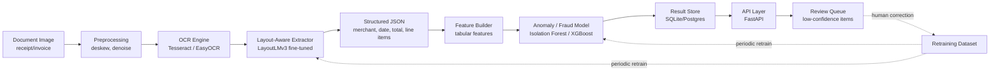

# Concept Paper

## Intelligent Document Processing & Fraud Detection Engine

**Prepared as:** Project Concept Paper
**Date:** September 2026
**Status:** Phase 0 (Setup) and Phase 1 (Vision Extraction) complete; Phase 2 in progress

---

## 1. Executive Summary

The **Intelligent Document Processing & Fraud Detection Engine (IDPAFDE)** is a portfolio-grade, production-shaped system that ingests unstructured document images — starting with receipts — extracts structured data from them using computer vision and NLP techniques, and flags statistically anomalous or potentially fraudulent records using a tabular machine learning model. The system is designed end-to-end: from image upload, through OCR and entity extraction, to fraud scoring and an API-served result.

The project's purpose is not novel research but a demonstration of applied **AI/ML Engineering** competency: pipeline design, model integration, evaluation discipline, and deployment — the practical skill set required to take a machine learning idea from raw data to a running, testable service. A core design constraint is that the entire system must be **buildable and runnable at $0**, using only free-tier and open-source tools throughout.

---

## 2. Background and Rationale

Organizations in fintech, business operations, and government routinely spend significant manual effort on two related tasks:

1. **Converting paper- or image-based documents** (receipts, invoices, forms) into verified, structured digital data.
2. **Manually auditing that data** for data-entry errors, duplication, or fraud.

Both tasks are repetitive, error-prone when done manually, and well-suited to automation through a combination of computer vision (to read the document), natural language/layout understanding (to interpret what was read), and classical machine learning (to judge whether a record looks suspicious). IDPAFDE builds a minimal but genuinely working version of that pipeline, using receipts as the first document type, to demonstrate how these techniques compose into a real system rather than isolated notebook experiments.

---

## 3. Problem Statement

Manual document-to-data conversion and manual fraud auditing do not scale with document volume, are inconsistent across reviewers, and provide no systematic, measurable way to flag anomalies before they reach a human. There is a need for a lightweight, reproducible pipeline that can:

- Accept a raw document image and reliably extract its text and layout.
- Convert that raw output into structured, verifiable fields (merchant, date, total amount, line items).
- Score each extracted record for statistical anomaly or likely fraud.
- Expose all of this behind a documented, testable API rather than a one-off script.

---

## 4. Objectives

### 4.1 General Objective
To design, build, and evaluate an end-to-end document processing and fraud detection pipeline for receipt images, served through an API, using only free and open-source tools.

### 4.2 Specific Objectives

| # | Objective | What it demonstrates |
|---|-----------|-----------------------|
| 1 | Build a working end-to-end pipeline on one document type (receipts) | Ability to ship a complete system, not just a model in isolation |
| 2 | Fine-tune an entity extraction model and measure its improvement over a rule-based baseline | Understanding of evaluation methodology, not just model training |
| 3 | Build a tabular anomaly/fraud detection model with engineered features | Classical ML skill, alongside deep learning |
| 4 | Serve the pipeline behind a logged, documented API | Understanding of deployment, not just modeling |
| 5 | *(Stretch)* Implement an active learning / retraining loop | Understanding of the full ML lifecycle, including feedback |

---

## 5. Scope and Limitations

**In scope for v1:**
- A single document type: receipts.
- Printed text only (no handwriting recognition).
- A local-first, single-instance deployment.
- Synthetic fraud-pattern injection for anomaly model evaluation, since real fraud-labeled receipt data is not freely available.

**Explicitly out of scope for v1 (deferred to v2+):**
- Generalization to other document types (invoices, tax forms, IDs).
- Handwriting recognition.
- Real-time streaming ingestion.
- Multi-user authentication, billing, or a production-grade frontend.
- Any paid API, paid compute, or paid dataset.

**Known limitations, documented rather than hidden:**
- No authentication on the API in v1 — not production-secure as-is.
- Synthetic fraud patterns are not a substitute for real fraud data; precision/recall figures describe performance against synthetic patterns only.
- Free-tier hosting, if used, carries cold-start latency and storage caps.

---

## 6. System Architecture

The system is organized as a layered pipeline, where each stage has a single, testable responsibility and a stable interface to the stage after it.

### 6.1 Component Responsibilities

| Component | Role |
|---|---|
| **Preprocessing** | Deskews, denoises, and contrast-normalizes input images using OpenCV before they reach OCR. |
| **OCR Engine** | Converts pixels into raw text and bounding boxes. Tesseract is used first for its zero-dependency footprint; EasyOCR/TrOCR are evaluated as upgrades in later phases. |
| **Layout-Aware Extractor** | Maps OCR tokens and their positions to structured fields. Begins as a rule-based/regex baseline, upgraded to a fine-tuned LayoutLMv3 model once labeled data exists. |
| **Feature Builder** | Converts a structured record plus historical context into a tabular feature vector (amount z-score, round-number flag, duplicate-hash flag, OCR-confidence aggregate, date plausibility, etc.). |
| **Anomaly/Fraud Model** | Scores each record. Isolation Forest provides an unsupervised baseline; XGBoost is trained once synthetic-fraud-labeled data is available, and the two are compared. |
| **Result Store** | SQLite for local development; optionally a free-tier Postgres host if multi-client access is needed later. |
| **API Layer** | FastAPI service exposing ingestion, query, and review endpoints, with auto-generated OpenAPI docs. |
| **Review Queue (stretch)** | Routes low-confidence extractions to a human reviewer; corrections feed a retraining dataset for periodic model updates. |

### 6.2 Data Flow

1. A client `POST`s a document image to the API.
2. The API runs preprocessing, then OCR, returning raw text and bounding boxes.
3. The extractor converts OCR output into structured fields.
4. The feature builder and anomaly model score the record.
5. The result is persisted and returned to the client as structured JSON with an anomaly score and a `review_required` flag.

---

## 7. Data Strategy

| Source | Content | Access |
|---|---|---|
| SROIE (ICDAR 2019) | ~1,000 scanned receipts with OCR and key-field ground truth | Free, research use — primary source, since it already has labeled merchant/date/total fields |
| Kaggle receipt/invoice OCR sets | Varied receipt photos | Free, used to diversify lighting/condition variety |
| Self-collected receipts | Own photographed receipts, personal payment data stripped | Free — used as a true generalization holdout |

Because labeled fraud data cannot be sourced for free, **synthetic fraud is injected** into the clean extracted dataset to create a supervised evaluation target: amount inflation, duplicate submission, date manipulation, merchant-swap, and round-number stuffing. Data is split 70/15/15 (train/validation/test) **before** injection to avoid leakage, and a small real-world holdout is never used in training.

---

## 8. Model Development Plan

| Layer | v1 Approach | Upgrade Path |
|---|---|---|
| OCR | Tesseract (fast to integrate, zero fine-tuning) | EasyOCR, then TrOCR for noisy/handwritten text |
| Entity extraction | Rule-based/regex baseline over OCR tokens | Fine-tuned LayoutLMv3 (HuggingFace, open weights), fine-tuned on a free Colab T4 GPU |
| Anomaly/fraud detection | Isolation Forest (unsupervised, no labels needed) | XGBoost (supervised, trained on synthetic-fraud-labeled data), with results compared against the Isolation Forest baseline |

Model experiments are tracked via a lightweight `experiments.csv` log (or self-hosted MLflow), and model artifacts are stored outside of git, with regeneration steps documented.

---

## 9. Service Interface (API)

The pipeline is served via **FastAPI**, versioned from the start under `/v1/`.

| Endpoint | Purpose |
|---|---|
| `POST /v1/documents` | Ingest a document image; returns extracted fields, extraction confidence, anomaly score, and review flag |
| `GET /v1/documents/{document_id}` | Retrieve a previously processed record |
| `GET /v1/documents` | List/filter processed documents |
| `POST /v1/documents/{document_id}/review` | Submit a human correction, feeding the active-learning dataset |
| `GET /health` | Liveness/readiness check |

Target non-functional requirements for v1: p95 latency under 5 seconds per document on local CPU, best-effort availability on a single instance, and no authentication requirement (documented as a known v1 gap rather than a production posture).

---

## 10. Deployment Strategy

The system is designed to run entirely on free infrastructure:

- **Primary path:** fully local via `docker compose up`, bringing up the API and SQLite store with no paid dependencies.
- **Optional hosted demo:** free-tier hosts such as Render, Railway, or Hugging Face Spaces for the API; SQLite or free-tier Supabase/Neon Postgres for storage; model weights bundled into the container or loaded from the Hugging Face Hub.
- **CI (optional):** GitHub Actions free tier for linting, test execution, and Docker image builds.
- **Explicit guardrail:** no paid OCR/vision APIs (Google Vision, AWS Textract, Azure Form Recognizer) and no hosted LLM APIs are used within the shipped pipeline, to keep the system reproducible at zero cost.

---

## 11. Development Roadmap

Each phase has a hard exit criterion; the project does not advance to the next phase until it is met, to avoid the common failure mode of partially building every layer without ever having a working system.

| Phase | Focus | Exit Criterion | Status |
|---|---|---|---|
| 0 | Setup | `docker compose up` returns 200 from `/health` | ✅ Complete |
| 1 | Vision extraction (raw) | Pipeline outputs raw text + bounding boxes with no crashes on 100% of the sample set | ✅ Complete |
| 2 | Baseline structured extraction | Rule-based field accuracy measured against ground truth | 🔄 In progress |
| 3 | Trained extraction model | Fine-tuned LayoutLMv3 F1 documented and compared to the Phase 2 baseline | ⏳ Planned |
| 4 | Anomaly/fraud layer | Precision/recall on synthetic fraud validation documented for Isolation Forest and XGBoost | ⏳ Planned |
| 5 | Service wrapper | End-to-end `POST /documents` call returns complete fields + anomaly score | ⏳ Planned |
| 6 | Deployment | Service reproducible via `docker compose up` from a clean checkout on another machine | ⏳ Planned |
| 7 | *(Stretch)* Active learning loop | Documented before/after metric improvement after one retraining cycle | ⏳ Optional |

---

## 12. Current Implementation Status

As of this document, **Phase 0 and Phase 1 are complete and validated**:

- A FastAPI skeleton with a working `/health` endpoint is in place.
- Image preprocessing (grayscale, denoise, deskew, contrast normalization via OpenCV) is implemented in `app/preprocessing.py`.
- OCR is implemented in `app/ocr.py` using **Tesseract** (via `pytesseract`), chosen over EasyOCR for Phase 1 specifically for its lighter footprint and CPU-only stability; this substitution is documented and will be reassessed in Phase 3 against measured accuracy.
- A new endpoint, `POST /v1/ocr/extract`, exposes the preprocessing + OCR pipeline over HTTP.
- Since the real SROIE dataset requires an authenticated manual download unavailable in the build environment, a synthetic sample-receipt generator (`scripts/generate_sample_receipts.py`) stands in for it; Phase 1's exit criteria have been validated against these synthetic samples, with validation against real SROIE data still outstanding.
- Automated exit-criteria tests (`test_phase0.py`, `test_phase1.py`) pass, confirming both phases meet their documented success conditions.

All deviations from the original plan (OCR engine choice, dataset substitution) are logged in `docs/CHANGELOG/CHANGELOG_PHASE1.md` together with the reasoning and the conditions under which each should be revisited.

---

## 13. Evaluation Plan

| Component | Metric | v1 Target |
|---|---|---|
| OCR | Character Error Rate vs. SROIE ground truth | Documented, establishes baseline |
| Baseline extractor | Field-level exact-match accuracy | Documented, becomes the benchmark to beat |
| Trained extractor (LayoutLM) | Field-level F1 | Must exceed the baseline |
| Anomaly model (Isolation Forest) | Precision/Recall on synthetic fraud set | Documented |
| Anomaly model (XGBoost) | Precision/Recall on synthetic fraud set | Compared against the Isolation Forest baseline |
| End-to-end pipeline | p95 latency | Under 5 seconds per document on local CPU |

Testing includes unit tests (preprocessing functions, feature builder, API schema validation), integration tests (full pipeline over a fixed sample set), and a regression guard requiring any new model version to match or exceed the metric of the version it replaces before being adopted.

---

## 14. Significance

For an AI/ML Engineering portfolio, IDPAFDE demonstrates the full lifecycle expected in industry practice rather than an isolated modeling exercise:

- **Systems thinking:** composing CV, NLP, and classical ML into one coherent, layered pipeline.
- **Evaluation discipline:** every model choice is benchmarked against a documented baseline before being adopted.
- **Engineering rigor:** phased delivery with hard exit criteria, automated tests, and a documented changelog of deviations from plan.
- **Deployment awareness:** a reproducible, containerized service rather than a notebook, built entirely within free-tier constraints — a realistic constraint for early-stage products and cost-conscious teams alike.
- **Practical applicability:** the underlying problem — converting documents to structured, audited data — is directly relevant to fintech, government, and business-operations contexts.

---

## 15. Companion Documents

This concept paper summarizes and is supported by the following detailed planning documents in the project repository:

| Document | Covers |
|---|---|
| `docs/00-PROJECT-CHARTER.md` | Purpose, goals, non-goals, success criteria |
| `docs/01-ARCHITECTURE.md` | System design, components, data flow |
| `docs/02-DATA-STRATEGY.md` | Datasets, schema, labeling process |
| `docs/03-MODEL-DEVELOPMENT.md` | OCR, entity extraction, anomaly model plans |
| `docs/04-API-SPEC.md` | Service contract and endpoints |
| `docs/05-DEPLOYMENT-FREE-TIER.md` | Free hosting and infrastructure choices |
| `docs/06-ROADMAP-MILESTONES.md` | Phased plan with exit criteria |
| `docs/07-TESTING-EVALUATION.md` | Metrics, test plan, QA checklist |
| `docs/CODEBASE-DOCUMENTATION.md` | Enterprise-style documentation of the system as currently implemented |
| `docs/CHANGELOG/CHANGELOG_PHASE1.md` | Detailed record of Phase 1 implementation and deviations from plan |